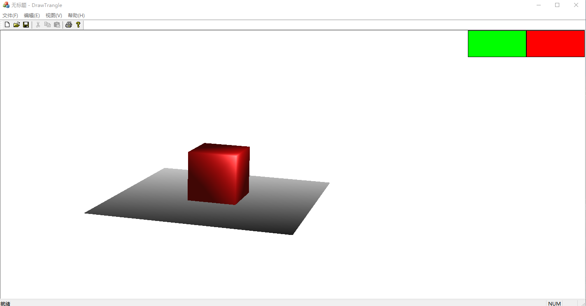

# 效果

> 打开程序后请切换到英文输入法
> 
> 现在遇到了函数使用超过堆栈限制的bug，好像会影响阴影的生成，而且因为这个bug实在是不好修，所以项目暂时搁置了，就这样吧

# 渲染方式
- 目前支持通过光栅化的方式渲染特定线框模型

- 默认情况下以透视投影的方式渲染，可以通过点击右上角的绿色方框来切换投影方式

## 光栅化

已支持背面剔除，深度测试，简单着色，PhongShader着色

渲染皆为CPU模拟GPU渲染并且未设置单线程，所以在渲染光照环境的时候会非常考验CPU的单核性能 ~~某种意义上的单核跑分软件~~

> 阴影写崩了 ~~未来会支持阴影~~ ~~(在写了在写了~~

### 加速结构
- 记忆化绘制线框
- 支持背面剔除

## 投影

- 平行投影和透视投影均为点对点投影，未设置可视空间

- 透视投影下有较多的bug，包括但不限于坐标轴突变，模型崩坏等，仍需等待解决

> 未设置透视投影矫正，~~等我把数学推导过程看懂后会加上的~~

## 模型

- 目前只支持对内置的立方体进行渲染，未来也许会支持对.obj模型的渲染

# 控制模式
- 渲染器有两种控制模式：模型模式和摄像机-坐标轴模式；默认情况下为模型模式

- 控制模式切换方式：点击窗口右上角的红框切换

- 控制键位主要位于三大区域：*WASD*、*TFGH*、*IJKL*。所有的键盘操作都位于这三大区域中

## 全局控制
此条目下的控制按键在任何时候都能生效
- C：开启/关闭背面剔除，默认处于开启状态
- 绘制线框模型的时候建议**关闭**此项，其他时候建议**打开**此项
 > 实时光照渲染时打开此项能极大提高性能 ~~(即使以当前的模型复杂度并不能直观感受到~~
 
- V ：切换渲染模型，默认渲染***PhongShader***
- 按下按键即可在**正方体**，**三角形面**，**混合颜色**，***PhongShader*着色**，**深度**和**线框模型**中切换

- B：切换坐标系渲染模式，默认为渲染坐标**线框**
- 按下按键可在**颜色**，**深度**，和**线框**中切换

## 摄像机-坐标轴模式
此模式下能控制摄像机和坐标轴，相关键位如下
- W/S：摄像机的X轴平移
- A/D：摄像机的y轴平移
- W/S：摄像机的Z轴平移
- J/L：摄像机绕X轴旋转
- I/K：摄像机绕Y轴旋转
- U/O：摄像机绕Z轴旋转
- R/Y：摄像机焦距增减 **此项仅在透视投影生效**
> 焦距增减的效果和视口缩放的效果相同，但在平行投影中并没有焦距的概念，故只有视口缩放对平行投影生效
- F：开启/关闭YoZ平面
- G：开启/关闭XoZ平面
- H：开启/关闭XoY平面
  
## 模型模式
此模式下能够控制模型（也就是立方体），相关键位如下
- W/S:模型的x轴平移
- A/D: 模型的y轴平移
- Q/E: 模型的z轴平移
- J/L: 模型围绕以自身为中心绕世界坐标系下x轴旋转
- I/K: 模型围绕以自身为中心绕世界坐标系下y轴旋转
- U/O: 模型围绕以自身为中心绕世界坐标系下z轴旋转
- F/H:模型围绕x坐标轴旋转
- T/G:模型围绕y坐标轴旋转
- R/Y:模型围绕z坐标轴旋转
- Z/E:模型以自身重心为中心缩放

# 其他
## 双缓冲技术
现在是CPU模拟GPU渲染并且未设置多线程，导致机器需要非常长的时间渲染单帧图像，这一定程度上降低了观感，所以计划采用双缓冲技术来提高展示效果。但由于渲染速度没有实质性变化，采用双缓冲后会加剧屏幕的闪烁。所以最后还是选择直接渲染到屏幕上，保留光栅化过程

## 现存的BUG
- 透视投影中如果相机离模型太近或者跨越坐标轴，那么图像就会出现模型崩坏，坐标反转的情况 ~~（暂时还没修bug的头绪~~
- 鼠标单击屏幕后渲染的图像会消失，点击键盘即可复原 ~~对啊为什么呢，渲染的图像为啥就消失了呢~~
- 在图像范围过大的时候ZBuffer会出现混乱，建议图像范围限制在800x800(像素)内
